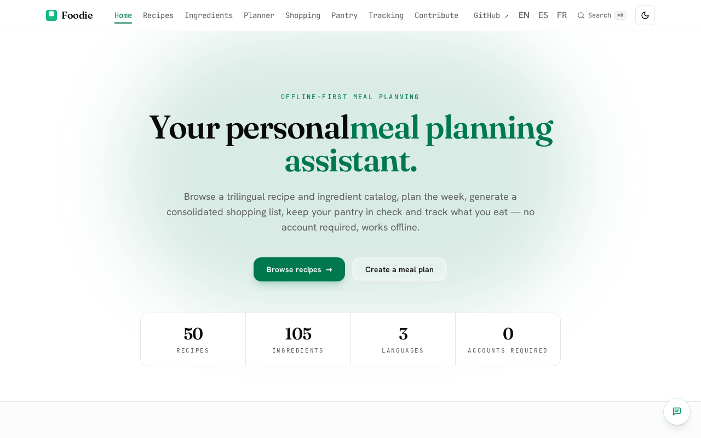
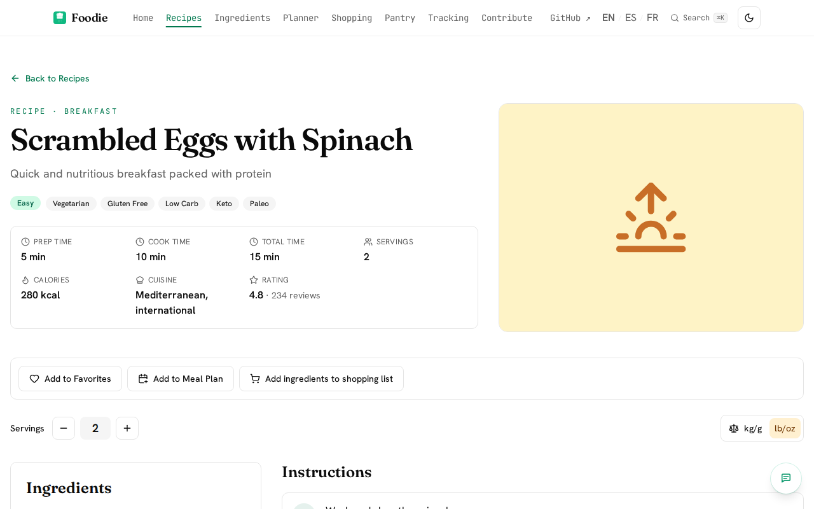
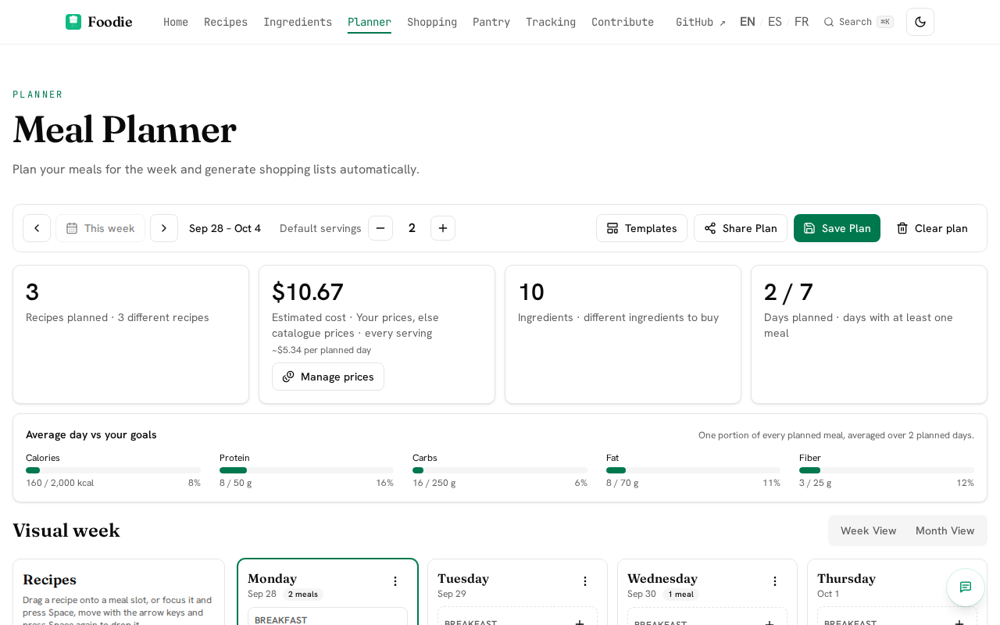
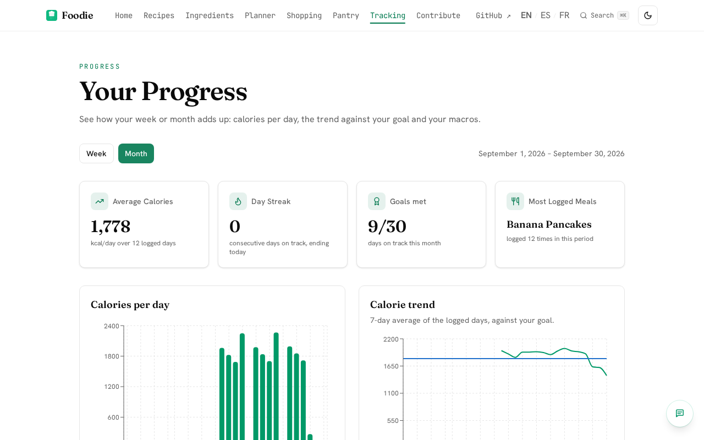

# Foodie

[](https://github.com/ArtemioPadilla/foodie/actions/workflows/ci.yml)
[](https://github.com/ArtemioPadilla/foodie/actions/workflows/deploy.yml)
[](https://github.com/ArtemioPadilla/foodie/actions/workflows/visual.yml)
[](https://github.com/ArtemioPadilla/foodie/actions/workflows/security.yml)
[](./LICENSE)

**Plan your meals, shop once, eat well — in English, Spanish or French, even offline.**

Foodie is an offline-first meal-planning web app: a catalog of 50 recipes and
105 ingredients in three languages, a weekly planner with drag and drop, a
shopping list generated from the plan, a pantry with expiry dates, and a food
diary with nutrition goals. Everything you enter stays in your browser;
signing in is optional.

- **Use it:** <https://eat.cybere.co/> (also [`/es/`](https://eat.cybere.co/es/) and [`/fr/`](https://eat.cybere.co/fr/))
- **Docs:** <https://eat.cybere.co/docs/> — getting started, guides, the data model and how to contribute, with search
- **v1:** the React 18 + Vite app is frozen at the tag
  [`legacy-vite-1.0.0`](https://github.com/ArtemioPadilla/foodie/tree/legacy-vite-1.0.0).
  Data saved by v1 in your browser carries over to v2, and old links redirect.
- **Moved:** browser storage is per address, so plans and lists saved on the
  old GitHub Pages address do not follow you to <https://eat.cybere.co/>; the
  old address offers a download of them before redirecting
  ([ADR 0015](docs/decisions/0015-cloudflare-pages-hosting.md)).

| Landing | Recipe detail |
|---|---|
|  |  |
| **Planner** | **Tracking progress** |
|  |  |

## Features

- **Recipes** — search, filter (meal type, cuisine, diet, difficulty, time)
  and sort, with the state in the URL; every recipe has a static page with a
  servings scaler, metric/imperial units, step timers, nutrition and JSON-LD.
- **Ingredients** — nutrition, composition, prices and the recipes that use
  each one; add to the pantry or the shopping list.
- **Planner** — seven days of breakfast, lunch, dinner and snacks; drag and
  drop with pointer or keyboard; templates; cost and nutrition summary; share
  a plan as a link, no server involved.
- **Shopping list** — generated from the plan, merged and converted, grouped
  by category and priced; your own items; CSV and text export.
- **Pantry** — quantities, locations and expiry dates, and "what can I cook"
  from what you have.
- **Tracking** — a food diary, daily goals and progress charts.
- **Accounts (optional)** — email, Google or GitHub sign-in keeps preferences
  and favourites per account; export or clear your data at any time.
- **Contribute** — a wizard turns your recipe into catalog JSON and a
  prefilled GitHub issue; Foodie never asks for a token.
- **PWA** — installable, works offline after the first visit.

## Stack

Built on the [Inceptor](https://github.com/ArtemioPadilla/inceptor) template:
**Astro 7** static pages with **React 19** islands, Tailwind v4, Base UI
primitives, Nano Stores, TanStack Query, react-hook-form + Zod, Recharts,
Motion, `@vite-pwa/astro` and Pagefind. Foodie adds `@dnd-kit` (planner),
`firebase` (optional sign-in, loaded on demand) and `fflate` (plan sharing).
The catalog is plain JSON in `public/data/`, validated with Zod at build time.
Deployed to Cloudflare Pages at <https://eat.cybere.co/> (see
[`docs/deploy/cloudflare-pages.md`](docs/deploy/cloudflare-pages.md); the
old GitHub Pages address redirects there).

## Quick start

```bash
git clone https://github.com/ArtemioPadilla/foodie.git
cd foodie
npm ci               # Node 22 (.nvmrc)
npm run dev          # http://localhost:4321/
```

| Command | What it does |
|---|---|
| `npm run check` | astro check, tsc, Vitest, ESLint, pragma check, build and built-site tests — the gate before every commit |
| `npm run test` | Unit tests (Vitest) |
| `npm run build && npx playwright test` | Screenshots, accessibility, smoke and the e2e journeys |
| `npm run test:e2e` | E2E journeys and the Content Security Policy gate |
| `npm run docs:screenshots` | Regenerate the images above from a running preview |

Configuration (base path, Firebase, feature flags) is documented in
[Configuration](https://eat.cybere.co/docs/getting-started/configuration/)
and `.env.example`.

## Contributing

Recipes and code are both welcome — see [`CONTRIBUTING.md`](./CONTRIBUTING.md).

- **A recipe:** prepare it with the in-app [Contribute](https://eat.cybere.co/contribute/)
  wizard (it downloads the recipe JSON; the public site opens no GitHub issue),
  then file it here with the `recipe-submission` issue form, or open a PR that
  edits `public/data/recipes.json`
  ([format](https://eat.cybere.co/docs/contributing/recipe-format/)).
- **Code:** every change starts as an issue and lands as a PR against `main`
  (issue → plan → implement → validate → PR). Read [`CLAUDE.md`](./CLAUDE.md)
  for the rules the codebase follows.

## Documentation map

- [Docs site](https://eat.cybere.co/docs/) — sources in `src/content/docs/`
- [Migration roadmap](./docs/superpowers/specs/2026-09-27-foodie-inceptor-migration-roadmap.md) — the plan behind v2 (48 issues, decisions D1–D14)
- [Architecture decisions](./docs/decisions/) — Foodie ADRs 0001, 0002, 0010–0014
- [`CLAUDE.md`](./CLAUDE.md) — conventions, stack and workflow for contributors and Claude Code
- [Component guide](./docs/COMPONENTS.md) and [catalog](./docs/component-catalog.md) — the UI kit
- [Runbooks](./docs/runbooks/) — cutover, offline PWA, repository cleanup
- [`CHANGELOG.md`](./CHANGELOG.md)

## License

[MIT](./LICENSE) © Artemio Padilla
